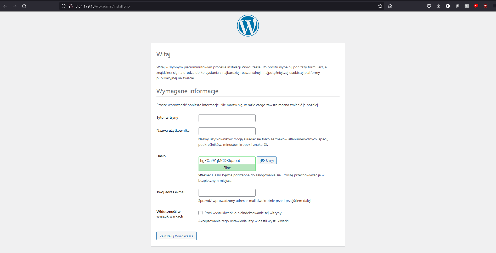
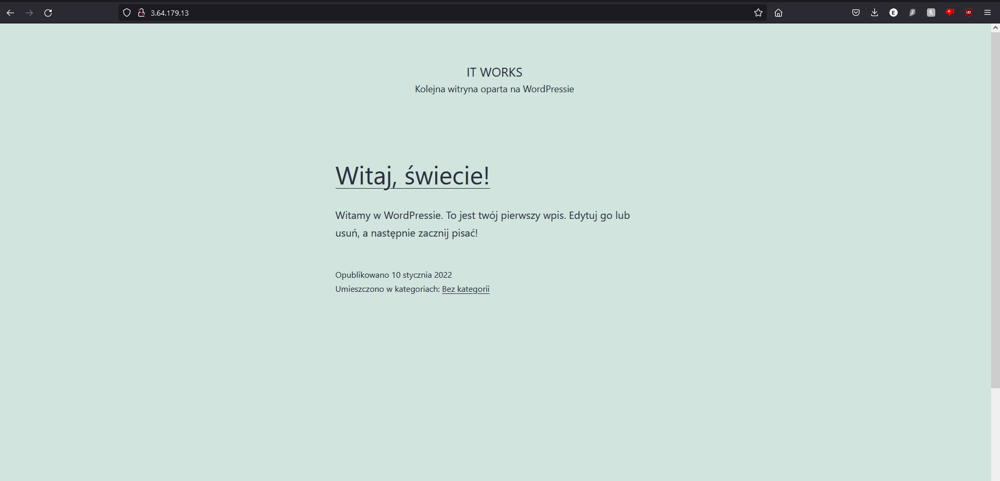

## Install wordpress

1. Sklonować to repozytorium
2. Zmodyfikować odpowiedno adresy ip w pliku hosts.ini
3. Wpisać w konsoli "eval `ssh-agent`"
4. Wpisać w konsoli "ssh-add <ścieżka do klucza id_student>"
5. Wpisać w konsoli "ansible-playbook -i hosts.ini setup_wp.yaml"
6. Połączyć się w przeglądarce internetowej z jedną maszyn "wp_nodes" przez jej publiczny adres ip (powinna pojawić się strona widoczna na pierwszym z poniższych screenshotów poniżej
7. Dokończyć instalację wordpressa w przeglądarce internetowej
8. Po zakończeniu powinna być widoczna strona na drugim screenshocie

